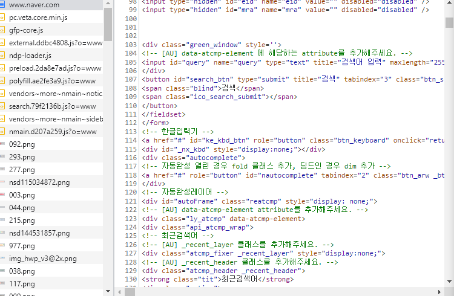

# CS
## Network
### * Road Map

 Internet = Intranet + \<Inter> + Intranet

 **\* 인터넷 작동 원리**

- 도메인 주소 입력
- DNS Server로 이동
- 해당 도메인 주소를 IP 주소로 반환 (도메인 IP 요청도 레벨에 따라 구분된다.(Local DNS -> another DNS))

**\* url의 구조**

- Protocol 
http : 평문(Plain Text)으로 요청(url에 기입된 내용 그대로) 
https : http + secure, 복호화 되서 정보 전달
- Domain : 요구하는 웹서버 지칭
- Path : / 뒤에 오는 부분, 웹서버에 있는 자원에 대한 경로
- Parameter(QueryString) : ? 뒤에 나오는 부분, key=value로 전달 되는 값으로 웹서버에 제공하는 추가 파라미터
- Fragment : 특정 요소를 지시하는 값 (ex. 해당 페이지의 스크롤 위치를 정하는 값)

**\* url 요청 시**
- naver.com 접속 시  
여러번의 Requet와 Response가 연속적으로 발생

- 많은 요소들을 한번에 요청하는것 보다 세분화하여 장애 대응이나 관리가 편하다.(실무에서도) 

**\* Content-Type**
- application/json 
RestFul API 
{key : value}
- application/x-www-form-urlencoded 
key=value&key=value

**\* 참고 사항** 
Postman 사용 시 querystring과 body 헷갈리지 말 것 
- Post 사용 시 body에 쓰여지는 Key=Value값과 Get 사용 시 쓰여지는 Key=value값 혼동 주의

**\* 참고 사항** 
http request를 tomcat이 자바 객체로 변환 
tomcat과 spring 둘 다 http를 객체로 사용하기 위함(springboot는 사용자의 편의를 위해 tomcat을 내장한다.)
