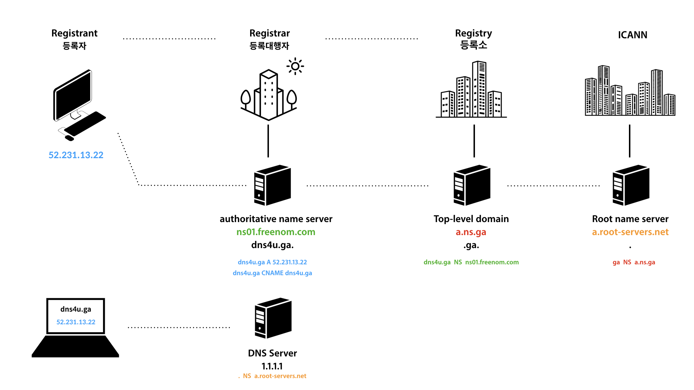

# CS
## Network
---
 자료, 내용 첨부 : https://www.youtube.com/playlist?list=PLuHgQVnccGMCI75J-rC8yZSVGZq3gYsFp  

#### host 
- 인터넷에 연결된 컴퓨터 한대 한대를 지칭한다.

#### DNS Server
- 수많은 IP주소와 도메인이 저장되어있는 Server이다.

#### hosts
- hosts 파일에 IP주소와 도메인 이름을 저장해서, 저장된 도메인 이름을 통해 다른 host에 접근할 수 있다.

- 모두가 내가 저장한 Domain-IP 설정으로 접속하는게 아닌 로컬 설정과 같다.

- 리눅스에서 hosts 파일의 localhost를 이유 모르고 바꿨었는데 주의 할 필요가 있었다.

#### Before DNS
- hosts 설정으로 Domain으로 접속(로컬단)
- 다같이 같은 도메인으로 접속하길, IP가 바뀌면 해당 도메인의 IP만 재설정 해주면 사용자가 혼동없이 사용하길 원함.
- Stanford Research Institute에서 전세계 hosts파일을 관리했는데, 인터넷이 커지면서 유지, 갱신에 큰 시간과 비용이 사용됨.

#### Ater DNS(Domain Name System)

1. hosts 파일 X
2. DNS Server 접속 요청 응답
3. 해당 웹사이트 접속 
-> File이 Server로 변경하며 간소화, 신속화

#### Public DNS
- 통신사가 IPS(Internet Service Provider)를 자동 제공
- 통신사가 내 정보를 알수 없기를 원하는 경우가 생김
- 기존 DNS Server보다 빠른 Server를 원함
- Public DNS는 검색으로 찾아볼 수 있음.

#### Domain Name Structure

1. Root DNS Server : Top-Level Server를 알고 있어야한다.
2. Top-Level Server : Second-Level Server를 알고 있어야 한다.
3. Second-Level Server :sub Server를 알고 있어야 한다.
4. sub : 해당 IP주소를 알려준다.

- 순서대로 1->2->3->4로 정보를 전달하여 요청한 정보를 찾는다.

#### Domain Proccess

- ICANN(Root name server)
- Registry (Top-Level domain)
- Registrar (authoritative server)
- Registrant(해당 IP)
- Recode Type : A(Address), NS(Name Server)

1. Client가 Naver요청
2. Client 요청을 DNS Server가 받는다.
3. DNS 서버가 Root Name Server로 요청을 전송한다.
4. Top-Level Domain의 정보를 갖고있는 Root Name Server가 요청을 전달한다.
5. authoritative name server의 정보를 갖고있는 Top-Level Domain이 요청을 전달한다.
6. authoritative name server 해당 IP를 응답한다.
7. 응답받은 해당 IP를 DNS Server가 Client에게 전달해서 IP주소를 알려준다.

---

#### nslookup 사용법
- 도메인 이름에 대한 정보를 조회 할 때 사용하는 도구.
- nslookup example.com 
\>>>  
Server: 168.126.63.1  
Address : 168.126.63.1#53 
 
Non-authoritative answer :  
Name : example.com  
Address : 93.184.216.34 

- 처음 나오는 Address는 컴퓨터에 연결된 DNS Server IP주소
- Non-authoritative answer는 cache가 응답한 경우 발생
- 직접 물어보려면 example.com의 Name Server를 알아야한다.

- nslookup -type=ns example.com
\>>> 
Server:		168.126.63.1 
Address:	168.126.63.1#53 
Non-authoritative answer: 
example.com	nameserver = b.iana-servers.net. 
example.com	nameserver = a.iana-servers.net. 
Authoritative answers can be found from: 
a.iana-servers.net	internet address = 199.43.135.53 
b.iana-servers.net	internet address = 199.43.133.53 
a.iana-servers.net	has AAAA address 2001:500:8f::53 
b.iana-servers.net	has AAAA address 2001:500:8d::53 
- Name Server가 2개 운영
- Name Server를 아래와 같이 직접 요청 가능
- nslookup example.com a.iana-servers.net 
\>>> 
Server : a.iana-servers.net 
Address : 199.43.135.53#53 
Name : example.com 
Address : 93.184.216.34 

#### 도메인 이름 장만하기
- 등록대행자를 통해 등록소에 등록해야한다.

#### DNS record와 CNAME 레코드
- 도메인 이름에 대한 정보 한건 한건을 DNS Record라고 한다.
- A : 하나에 도메인에 여러 개의 IP주소 등록
- AAAA :  A의 확장형으로 도메인에 IPv6 주소가 매핑되어 있는 레코드
- CNAME : 도메인 별명 레코드라고 하며, Alias라고 하여 기존 도메인에 별명을 붙인 레코드
- MX : 해당 도메인과 연동되어 있는 메일서버를 확인하는데 사용하는 레코드 
naver.com -> 10:mx1.naver.com
- NS : 네임서버 레코드로 도메인에 대한 네임서버 권한을 갖고 있는지 알려주는 레코드 
naver.com -> e-ns.naver.com
- PTR : IP 주소에 대한 도메인 주소를 확일할 수 있는 레코드
- SOA : 도메인의 정보를 갖고 있는 레코드 
naver -> ns1.naver.com webmaster.naver.com 2021012809 21600 1800 1209600 180
- TXT : 텍스트를 입력할 수 있는 레코드
- CAA : 도메인 인증기관에 관련된 레코드

#### Github에 도메인 연결
- Github의 경우 setting - custom domain을 설정

