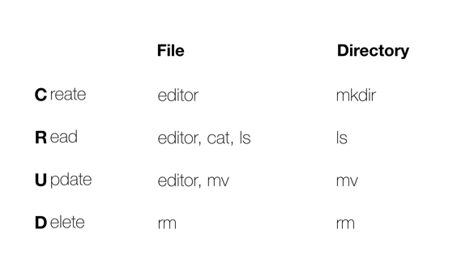

# CS
## OS
---
- 참고자료  
https://www.youtube.com/playlist?list=PLuHgQVnccGMBYk9U5yU6fljdZTPPRBy4n

#### CLI 
- Unix기반 시스템(linux, Mac os)을 컨트롤 할 수 있는 표준어다.
- emulator, ssh를 이용해 실습할 수 있다.
- Git hub 을 쓰려고 설치한 git bash가 emulator였다.
- 원격 접속을 위한 프로토콜이 ssh다.(cloud에 접속해 컨트롤 하는 putty)
---
#### CRUD

- 데이터는 파일에 저장되고 디렉토리를 통해 파일을 관리.
-파일과 디렉토리를 이용해 데이터를 처리하는게 중요 
- pwd : 현재 경로 표시
- / : root directory
- ~ : home directory
- rm : 삭제(조심히 사용)
- 터미널 켰을 때 기본위치 = home directory
- cd (change directory) 
- cd / : 최상위 디렉토리 이동
- cd ~ : home directory로 이동
- cd 경로 : 해당 경로로 이동
---
- ls : 현재 위치 파일과 디렉토리 확인
- 'command' --help : 해당 명령어 설명
- man 'command' : 해당 명령어 매뉴얼
- ls -l : 상세 ls
- touch 'filename' : 파일 생성
- touch .'filename' : 숨김 파일 생성
- ls -a : 숨김파일까지 표시
---
- mkdir 'directory name' : 디렉토리 생성
- ./ : 현재 디렉토리 vs /(root)
- mv 'A' 'B' : directory  A를 B로 변경(rename)
- mv 'A' '../' : A를 ../ 경로로 이동 
- rm 'filename' : 파일 삭제
- rm -r 'dirname' : 디렉토리 삭제
---
#### 상대 경로와 절대 경로
- / : 절대 경로로 이동한다.
- .. : 현재 상위 이동한다.
- ./'directory' : 현재 하위 directory로 이동
---
#### 편집기
- nano '' :  
 ctrl+O : write
 ctrl+X : exit
- cat '' : 파일 내용 화면 표시  
---
#### Command Line Interface
- 순차 명령 실행 : ; 
mkdir dummy;cd dummy; touch hello.txt;cd ..;ls -R
- 실패하면 멈추기 : && 
mkdir dummy&&cd dumy&& touch hello.txt&&cd ..&&ls -R 
결과 : no such file or directory: dumy
---
#### 추후 학습
- shell script
- package manager(apt-get, yum)
- maintain (top, htop)
storage - memory - processor
- computer architecture
- network