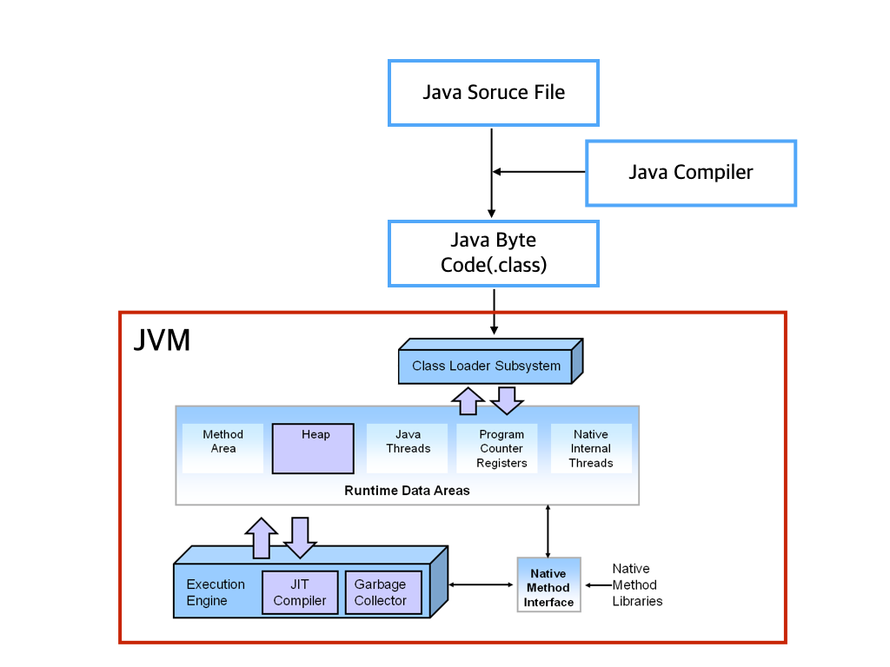
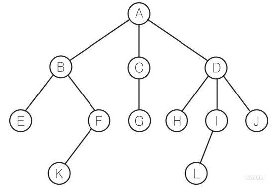
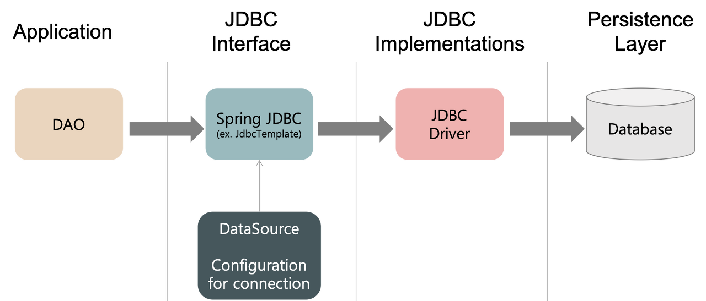
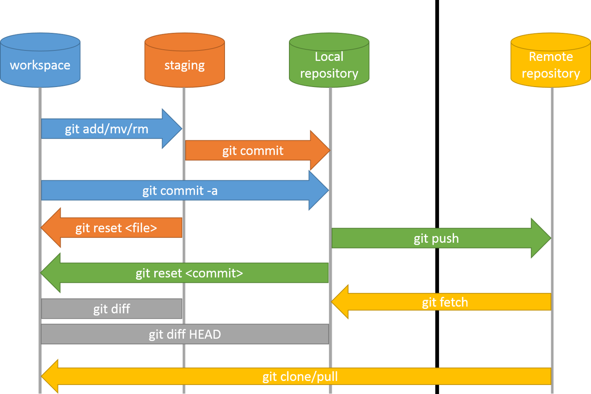

## 2022-04-06
 

### 1. JVM (Java Virtual Machine) 
.Java byte code를 OS에 맞게 해석해주는 역할
OS에서 바로 실행 되는게 아니기 때문에 OS에 맞게 해석해주는 역할을 한다.
 
JVM구조는 3가지 종류가 있다. 
1) Class Loader : Runtime 시점에 클래스를 로딩하게 해주며 클래스의 인스턴스를 생성하면 클래스 로더를 통해 메모리에 로드 
 
2) Runtime Data Areas : JVM이 프로그램을 수행하기 위해 OS로 부터 별도로 할당 받은 메모리 공간을 말한다. 5가지 영역으로 나눌 수 있다.
. PC Register 
. Java Virtual Machin Stack 
. Native Method Stack 
. Method Area 
. Heap 
 
3) Excution Engine 
. Load 된 Class의 ByteCode를 실행하는 Runtime Module이 바로 Excution Engine이다. Class Loader를 통해 JVM 내의 Runtime Data Areas에 배치된 바이트 코드는 Execution Engine에 의해 실행된다. 실행 엔진은 Java ByteCode를 명령어 단위로 읽어서 실행 
###### (제일 처음 배우는 부분이였다.)  
 

### 2. java compile  
 
1) 자바 소스 코드 작성(java) 
2) 자바 컴파일러가 자바 소스코드를 읽어 바이트 코드로 컴파일(java -> class) 
3) class 파일은 JVM은 읽을 수 있지만 컴퓨터가 읽을 수 있는 코드는 아니다. 
4) compile 된 byte code(class)를 JVM의 클래스 로더(class loader)에게 전달 
5) 클래스 로더는 동적로딩(Dynamic Loading)을 통해 필요한 클래스들을 로딩 및 링크하여 런타임 데이터 영역(Runtime Data Area), 즉 JVM의 메모리에 올린다. 
6) 실행 엔진(Excution Engine)은 JVM 메모리에 올라온 바이트 코드들을 명령어 단위로 하나씩 가져와서 실행, 이 때 엔진은 두가지 방식으로 변경 
. 인터프리터 : 바이트 코드를 명령어 하나씩 읽어서 해석하고 실행, 하나하나의 실행은 빠르나 전체적인 실행 속도가 느리다. 
. JIT컴파일러 : 인터프리터의 단점을 보완하기 위해 도입된 방식으로 바이트 코드 전체를 컴파일 하여 바이너리 코드로 변경하고 이후에는 해당 메서드를 더 이상 인터프리팅 하지 않고, 바이너리 코드로 직접 실행하는 방식 
##### (원 모어 찬스였다.)  
 

### 3. MVC 
 
1) Model :  
. 사용자가 편집하길 원하는 모든 데이터를 가지고 있어야한다. 
. 뷰나 컨트롤러에 대해서 어떤 정보도 알지 말아야한다. 
. 변경이 일어나면, 변경 통지에 대한 처리방법을 구현해야만한다. 
 
2) View :  
. 모델이 가지고 있는 정보를 따로 저장해서는 안된다. 
. 모델이나 컨트롤러와 같이 다른 구성요소를 몰라야한다. 
. 변경이 일어나면 변경 통지에 대한 처리방법을 구현해야만 한다. 
 
3) Controller :  
. 모델이나 뷰에 대해서 알고 있어야 한다. 
. 모델이나 뷰의 변경을 모니터링 해야한다. 
Why? 
유지보수성, 확장성, 유연성, 중복코딩 방지 
역할 분담의 가이드라인 
 

### 4. sort 종류 
1) 실행 방법에 따른 분류 
. 비교식 정렬(comparative sort) : 한 번에 두 개씩 비교 교환 
. 분산식 정렬(distribute sort) : 키값을 기준으로 여려 개의 부분 집합으로 분해, 각 부분 집합을 정렬 
 
2) 정렬 장소에 따른 분류  
. 내부 정렬(internal sort) : 메모리에 올려 정렬 방식, 빠르지만 자료의 양이 메인 메모리의 용량에 따라 제한 
.. 교환 방식(Selection, Bubble, Quick) 
.. 삽입 방식(Insertion, Shell) 
.. 병합 방식(2-way, n-way) 
.. 분배 방식(Radix) 
.. 선택 방식(Heap) 
. 외부 정렬(external sort) : 보조 기억장치에서 정렬하는 방식, 내부 정렬보다 속도는 떨어지지만, 대용량의 자료에 대한 정렬이 가능하다. 
.. 병렬 방식(2-way, n-way) 
##### (극히 일부만 알고 있었다.) 
 

### 5. 프로시저 
1) 변수 
. 변수 선언 : Declare @name nvarchar(10) 
. 변수 초기화 : Set @name = '와 이걸 생각 못했다.' 
 
2) 쿼리와 프로시저의 비중 
. 개인적인 의견 : 디버그가 가능하면 좋지만 그렇지 않은 경우 프로시저가 이중, 삼중으로 연결 되어있을 시, 변수가 있어야 실행이 가능 할 때 프로시저 분석하기가 어려운 부분이 있었다.  
명확한건 테이블로 구성하고, 일부 값을 추출하는 경우 프로시저 이용이 좋지 않을까. 
 

### 6. 스택, 큐, 힙, 트리  
1) 스택 : 모든 원소들의 삽입과 삭제가 리스트의 한쪽 끝에서만 수행되는 제한 조건을 갖는 선형 자료 구조(FILO)
 
 
2) 큐 : 리스트의 한쪽 끝에서는 원소들이 삭제, 반대쪽에서는 원소들의 삽입하는 순서화된 리스트(FIFO)
 
 
3) 힙 : 컴퓨터의 기억 장소에서 그 일부분이 프로그램들에 할당 되었다가 회수되는 작용이 되풀이 되는 영역. 
블록의 크기, 요구, 횟수 순서가 일정한 규칙이 없다. 
 
4) 트리 : 어떤 하나의 집합으로부터 하위 레벨로 가지가 나오는 집합 관계를 갖는 계층 구조
 
 

### 7. OOP, AOP  
1) OOP (Object-Oriented Programming : 객체 지향 프로그래밍) 
.캡슐화 
.정보은닉 
.추상화 
.상속성 
.다형성 
.객체지향 설계 5원틱 SOLID 
..S-Single reposibility principle : 역할에 맞춰 한 가지 기능을 갖게한다. 
..O-Open/closed principle : 엔티티들의 확장은 권장하지만 기존 모듈의 수정은 권장하지 않는다. 추상화 사용 
..L-Liskov Substitution principle : 상속관계에서 자식클래스는 부모클래스의 예측 범주 안에서 기능이 이루어져야 한다. 
..I-Interface Segregation principle : 인터페이스를 지나치게 범용적으로 구현은 삼가해야한다. 
..D-Dependency Inversion principle : 상위 모듈과 하위모듈을 독립화 해서 사용. 추상클래스 이용. 
 
2) AOP (Aspect-Oriented Programming : 관점 지향 프로그래밍)  
.core concern(핵심관심) : 각 서비스의 핵심 비즈니스 로직 
.crosscut concern(횡단관심) : 공통 모듈 
.AOP의 핵심은 공통 모듈을 분리시켜 해당 소스코드가 외부의 다른 클래스에서 존재하는 것. 
..인터넷의 어떤 동작에도 보안 기능이 필요하다. 모든 기능에 횡단 관심인 보안 기능이 들어가는데 이 중복 작업을 줄일 수 있다. 
.장점 
..각 비즈니스 로직마다 발생하는 중복 코드를 줄일 수 있다. 
..각 비즈니스 로직에만 집중할 수 있고, 유지보수가 쉬워진다. 
..재활용성이 높아진다. 
.구성요소 
..JointPoint : 횡단 관심을 삽입할 시점 
..PointCut : 어떤 클래스에 어떤 함수를 삽입하는 위치 
..Aspect : JointPoint + PointCut 
..Advice : 무엇을 삽입 할지 
..Weaving : Aspect + Advice. 지정된 객체를 새 Proxy 객체로 생성 
..Proxy : 횡단 관심이 핵심관심에서 직접 실행되지 않고 Proxy 대리인을 통해 생성해 실행된다. 
 

### 8. 객체 지향 언어의 장점  

.재활용성 
.응집도 높임 
.결합도 낮춤 
.유지 보수 

 

### 9. REST / API / ful 
1) REST :   
.Representational State Transfer : 자원의 이름으로 구분하여 해당 자원의 상태를 주고 받는 모든 것. 
.HTTP URI를 통해 자원을 명시하고, HTTP Method를 통해 해당 자원에 대한 CRUD Operation을 적용하는 것을 의미 
.CRUD Operation 
..Create : POST 
..Read : GET 
..Update : PUT 
..Delete : DELETE 
..HEAD : HEAD 
2) REST API(Application Programming Interface) : REST 기반으로 서비스 API를 구현한 것 
3) RESTful : 일반적으로 REST라는 아키텍처를 구현하는 웹 서비스를 나타내기 위해 사용되는 용어다. / 즉 REST 원리를 따르는 시스템은 RESTful이란 용어로 지칭된다. 
 

### 10. jdbc / jpa 
1) jdbc : DB에 접근할 수 있도록 Java에서 제공하는 API 
 
 
2) jpa : java ORM 기술에 대한 API 표준 명세로 java에서 제공하는 API다. 
 
 

### 11. was / web server 
 
 
1) Web Server : ex ) apache server, nginx, IIS 
.Web Server 구조 
..하드웨어 : Web Server가 설치되어 있는 컴퓨터 
..소프트웨어 : 웹 브라우저 클라이언트로부터 HTTP 요청을 받아 정적인 컨텐츠를 제공하는 컴퓨터 프로그램 
.Web Server 기능  
..HTTP 프로토콜을 기반으로 클라이언트의 요청을 서비스 하는 기능 
..정적인 컨텐츠 제공 
..WAS를 거치지 않고 바로 자원을 제공 
..동적인 컨텐츠 제공을 위한 요청 전달 
..요청을 WAS에 전달하고, WAS가 처리한 결과를 클라이언트에 전달. 
.Web Server 필요 이유 
..정적 컨텐츠만 처리하도록 기능을 분배하여 서버의 부담을 줄인다. 
 
2) WAS(Web Application Server) : ex) tomcat, jboss, jeus, web sphere 
.WAS는 DB 조회나 다양한 로직 처리를 요구하는 동적인 컨텐츠를 제공하기 위해 만들어지 Application Server 
.웹 컨테이너 혹은 서블릿 컨테이너라고 불린다. 
.WAS의 역할 
..Web Server 기능들을 구조적으로 분리하여 처리하고자 하는 목적으로 제시 
.WAS의 기능 
..프로그램 실행 환경과 DB접속 기능 제공 
..여러개의 트랜잭션 관리 기능 
..업무를 처리하는 비즈니스 로직 수행 
.WAS 필요 이유 
..WAS를 통해 요청에 맞는 데이터를 DB에서 가져와서 비즈니스 로직에 맞게, 때에 맞게 결과를 만들어서 제공함으로써 자원을 효율적으로 사용할 수 있다. 
.분리 이유  
..서버 부하 방지 
..물리적 분리로 보안강화 
..여러대의 WAS 연결 가능 
..즉 자원 이용의 효율성 및 장애 극복, 배포 및 유지보수의 편의성 

 
 

### 12. 서버 환경에서 특정 언어를 호환하지 않는다면 해결 방법은? 
.import 하여 사용 가능하지 않을까? 생각 못했던 방법이였다. 
 

### 13. Java Spring Batch  
.Spring Batch는 로깅/추적, 트랜잭션 관리, 작업 처리 통계, 작업 재시작, 건너뛰기, 리소스 관리 등 대용량 레코드 처리에 필수적인 기능을 제공한다. 
. https://deeplify.dev/back-end/spring/batch-tutorial 
 

### 14. Git 
1) 구조  
 
2) 장점  
. 버전 관리 용이 
. 대규모 프로젝트 진행에 있어서 업무 분할 및 다수의 협업을 통한 프로젝트 개발 용이 
 

2022-04-07 업데이트 예정 
15. java version 차이점 
16. 언어, 산업 트렌드 

 

- Feedback :  
기본적인 부분에 대해 확실히 아는게 중요하고,  
산업 트렌드 외의 언어 버전의 트렌드도 같이 파악  
구체적인 이유  
하고싶은 서비스 모델에 대한 구체적이게 
